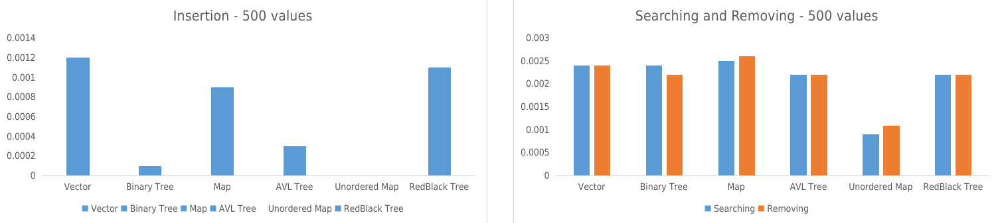
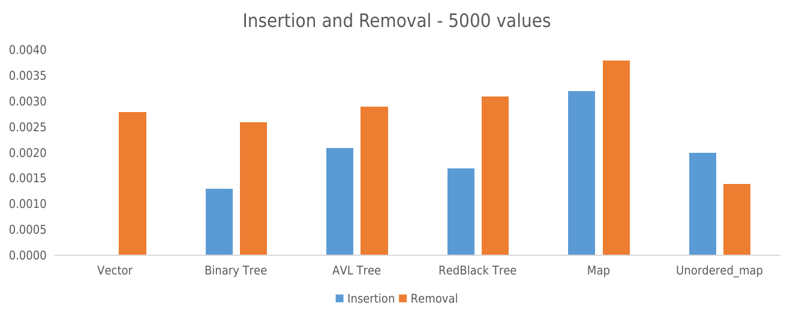
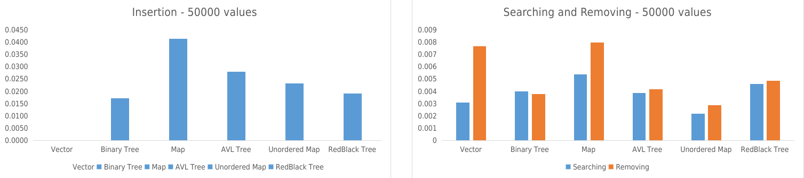
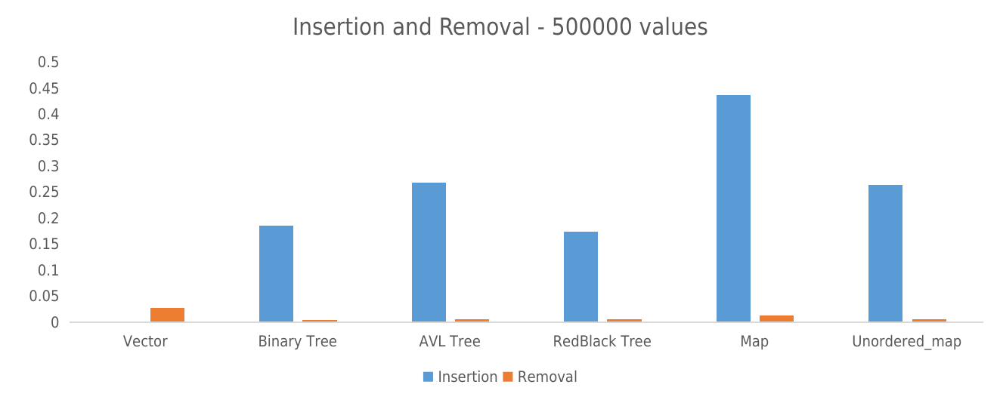
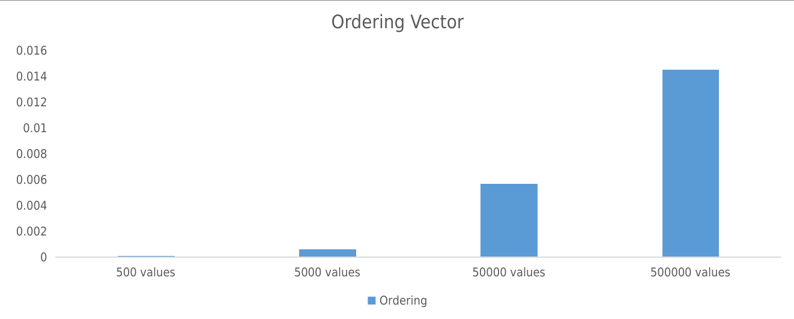

<h1 align = "center">
    Comparação de Estruturas de Dados
</h1>

<h4 align = "center">
    Durante a disciplina de Algoritmos e Estruturas de Dados II, foram vistos diversos recursos nativos ou que podem ser implementados na linguagem C++, como map, vector, unordered_map e variados tipos de árvores. Entretanto, não fica clara a eficiência de cada um deles para determinados tipos de entradas e circunstâncias. Nesse repositório, há a aplicação de todas as estruturas supracitadas, dando ênfase não a sua implementação, mas sim ao seu desempenho em quatro diferentes situações.
</h4>

<h2 align = "center">
    ⚠️
    <strong>
        <em> Problemática </em>
    </strong> 
</h2>

<h4 align = "center">
    Diferentes tipos de estruturas apresentarão diferentes comportamentos em variados tipos de input. Arquivos de 500, 5000, 50000 e 500000 valores serão os distintos dados, mas faz-se necessário concernir: 
</h4>

<strong>
    <dl>
        <dt align="center"> Qual estrutura desempenha melhor?</dt>
        <dt align="center"> Por qual razão uma estrutura performa melhor que outra?</dt>
    </dl>
</strong>

<h2 align = "center">
    ⚙️
    <strong>
        <em>Estruturas utilizadas</em>
    </strong>
</h2>

<table align = "center">
    <tr>  
        <td align = "center"> Árvore Binária de Pesquisa</td>
    </tr>
    <tr>  
        <td align = "center"> Árvore AVL</td>
    </tr>
    <tr>  
        <td align = "center"> Árvore RedBlack</td>
    </tr>
    <tr>  
        <td align = "center"> std::vector</td>
    </tr>
    <tr>  
        <td align = "center"> std::map</td>
    </tr>
    <tr>  
        <td align = "center"> std::unordered_map</td>
    </tr>
</table>

<h2 align="center">
    📚 <strong>
        <em> Bibliotecas utilizadas</em>
    </strong>
</h2>

<table align = "center">
    <tr>  
        <td align = "center"> iostream </td>
    </tr>
    <tr>  
        <td align = "center"> iomanip </td>
    </tr>
    <tr>  
        <td align = "center"> string </td>
    </tr>
    <tr>  
        <td align = "center"> fstream </td>
    </tr>
    <tr>  
        <td align = "center"> unordered_map </td>
    </tr>
    <tr>  
        <td align = "center"> map </td>
    </tr>
    <tr>  
        <td align = "center"> vector </td>
    </tr>
    <tr>  
        <td align = "center"> time.h </td>
    </tr>
    <tr>  
        <td align = "center"> unistd.h </td>
    </tr>
</table>

<h2 align = "center">
    🔬
    <strong>
        <em>Tipos de testes</em>
    </strong>
</h2>

<h4 align="center">
    A fim de obter as respostas para a problemática apresentada, será seguido o seguinte roteiro, para todas as estruturas:
</h4>

- Serão inseridos, em diferentes endereços de memórias das mesmas estruturas, as diferentes quantidades de valores, advindos de um arquivo .txt:
    - 500 valores;
    - 5000 valores;
    - 50000 valores;
    - 500000 valores.

- Após a inserção, será realizada a busca e remoção de 10.000 valores, também coletados a partir de um arquivo .txt;

**_Para cada um dos processos acima, será contabilizado o tempo necessário para realizar o que se deseja, fator que servirá de base para a conclusão da problemática apresentada._**

Além do que foi supracitado, ainda serão realizados mais dois testes aplicados à estruturas específicas:

- Verificar o ganho ao comparar a execução de todas as estruturas à de um **std::vector** ordenado, aplicado ao mesmo a pesquisa binária, além do tempo de ordenação do mesmo;

- Verificar se há ganhos no processo de pesquisa ao comparar dados das estruturas **std::map** e **std::unordered_map** com dados obtidos Árvores.

<h2 align="center"> 
   💡<strong>
        <em>Algoritmo </em>
    </strong>
</h2>

<d1>
    <dt> 1. Criar a estruturas necessárias e declará-las, sendo quatro de cada tipo, cada uma essas quatro referentes a uma quantidade de valores; </dt>
    <dt> 2. Preencher cada uma delas com seus respectivos arquivos;</dt>
    <dt> 3. Obter o tempo de execução do processo anterior;</dt>
    <dt> 4. Realizar a busca e remoção dos 10.000 valores, em cada uma das 4 variáveis de cada tipo;</dt>
    <dt> 5. Obter o tempo de execução do processo anterior;</dt>
    <dt> 6. Para o processamento dos dados no <strong>std::vector</strong>, obter o tempo necessário para ordenação do mesmo;</dt>
    <dt> 7. Mostrar ao usuário os dados coletados.</dt>
</d1>

<h2 align="center"> 
   ❗<strong>
        <em>Observações importantes</em>
    </strong>
</h2>

- Para cada uma das estruturas, foi criada uma pasta com seu respectivo nome, a qual contém uma espécie de "main", denominada **_NomeDaEstrutura_**...Processing.hpp. Caso seja necessário realizar alterações, como por exemplo, nomes de arquivos, essa mudanças devem ser realizadas dentro de cada um desses subarquivos;
- As impressões informam ao usuário o número de remoções realizadas em cada um dos arquivos, caso deseje um número maior de remoções, é necessário trocar o arquivo, assim como seu nome nas pastas de cada uma das estruturas, como pautado anteriormente; 
- Cada uma das pastas supracitadas contém um arquivo **.hpp** denominado "includes". Se, por algum motivo, haja o anseio de usufruir de algum recurso extra da linguagem, é necessário incluí-lo no arquivo mencionado, para o tipo de dado desejado (diferenciável pelo nome da pasta);

<h2 align="center">
    📖<strong>
        <em> Compreendendo as estruturas</em>
    </strong>
</h2>

#### Árvore Binária
Estrutura simples que conta com um nó denominado raiz, a qual é o primeiro elemento inserido. A raiz possui dois ponteiros, sendo o filho esquerdo e o filho direito.
A partir disso, o próximo elemento é inserido, seguindo a seguinte lógica:
    
- Caso seja maior que o nó anterior, seguirá para o caminho dos filhos direitos até que seja encontrado um valor para qual o mesmo seja menor, seguindo para o caminho esquerdo, repetindo o processo até encontrar uma posição que seja **NULL**, sendo portanto, registrado.
- Caso seja menor que o nó anterior, seguirá para o caminho dos filhos esquerdos até que seja encontrado um valor para qual o mesmo seja maior, seguindo para o caminho direito, repetindo o processo até encontrar uma posição que seja **NULL**, sendo portanto, registrado.

Como o principal âmbito desse projeto é o tempo de processamento, é de extrema importância estar atento aos **Custos Computacionais** relacionados à essa estrutura:

<table align="center">
    <tr>
        <td align = "center">Melhor caso</td>
        <td align = "center">O(1)</td>
    </tr>
    <tr>
        <td align = "center">Caso médio</td>
        <td align = "center">O(n)</td>
    </tr>
    <tr>
        <td align = "center">Pior caso</td>
        <td align = "center"> O((n + 1) / 2) </td>
    </tr>
    <tr>
        <td align = "center">Busca sem sucesso</td>
        <td align = "center"> O(n + 1) </td>
    </tr>
</table>

Além disso, há de salientar o causador do pior caso, sendo ele a inserção de valores ordenados, indiferentemente da ordem, o que causa o efeito de uma Lista Linear, gerando o custo de caminhamento em O(n).

Para maior detalhamento, o conteúdo referente a Árvores Binárias pode ser encontrado no livro [**Algoritmos - Teoria e Prática**](https://www.amazon.com.br/Algoritmos-Teoria-Pr%C3%A1tica-Thomas-Cormen/dp/8535236996), por [Thomas H. Cormen](https://en.wikipedia.org/wiki/Thomas_H._Cormen), no capítulo 12. 

#### Árvore AVL
Essa estrutura tem como grande diferencial uma proposta para contornar a situação de pior caso presente nas <a href="#árvore-binária">Árvores Binárias</a> (inserção ordenada), por meio do conceito de balanceamentos. Seu propósito gira em torno de manter as subárvores esquerda e direita com uma altura aproximadamente parecida, a fim de que ela possa ser avaliada em **log(n)**.

A fim de garantir o balanceamento supracitado, é calculado o desequilíbrio a partir dos níveis mais profundos de cada subárvore e, caso o índice de desbalanceamento seja maior ou igual a 2, haja visto que a mesma aceita no máximo 2 níveis de desequilíbrio, a árvore é refatorada por meio de rotações, sendo elas:
- Simples para a esquerda;
- Simples para a direita;
- Dupla para a esquerda:
    - Rotação simples para a direita;
    - Rotação simples para a esquerda;
- Dupla para a direita:
    - Rotação simples para a esquerda;
    - Rotação simples para a direita;

Novamente, como o principal âmbito desse projeto é o tempo de processamento, é de extrema importância estar atento aos **Custos Computacionais** relacionados à essa estrutura. Como o princípio da estrutura é estar sempre balanceada, para todos os casos a mesma apresentará o custo **O(log(n))**.

Para maior detalhamento, o conteúdo referente a Árvores AVL pode ser encontrado no livro [**Algoritmos - Teoria e Prática**](https://www.amazon.com.br/Algoritmos-Teoria-Pr%C3%A1tica-Thomas-Cormen/dp/8535236996), por [Thomas H. Cormen](https://en.wikipedia.org/wiki/Thomas_H._Cormen), no capítulo 13. 

#### Árvore RedBlack
Assim como nas <a href="#árvore-avl">Árvores AVL</a>, as árvores RedBlack também se diferem das binárias comuns por sua capacidade de rebalanceamento, mais uma vez se livrando do problema da inserção ordenada e mantendo as subárvores esquerda e direita com a altura aproximadamente parecida, buscando o tempo de execução de **log(n)**.

A fim de garantir o balanceamento supracitado, todos os nós recebem uma coloração, sendo eles vermelhos ou pretos, além de uma das regras ser que a raiz deve sempre ser preta. Caso um nó seja vermelho, é necessário que todos seus vizinhos sejam pretos, tendo também a propriedade de, em toda inserção, o novo nó receberá a coloração vermelha. O balanceamento se dá por meio de roteações, assim como nas <a href="#árvore-avl">Árvores AVL</a>.

Para esse tipo de estrutura, é necessário um aprofundamento maior, haja visto que a mesma é a mais complexa presente nesse repositório. Esse detalhamento adicional pode ser encontrado no livro [**Algoritmos - Teoria e Prática**](https://www.amazon.com.br/Algoritmos-Teoria-Pr%C3%A1tica-Thomas-Cormen/dp/8535236996), por [Thomas H. Cormen](https://en.wikipedia.org/wiki/Thomas_H._Cormen), no capítulo 13.

#### Map
A estrutura em questão pode ser relacionada à uma Tabela Hash, porém ordenada e nativa da linguagem. Tendo esse conceito em mente, a mesma armazena valores por meio de pares **Chave** e **Valor**, podendo haver somente um tipo de chave.

Para maior detalhamento, o conteúdo referente ao **std::map** pode ser encontrado no site [**cplusplus**](https://cplusplus.com/reference/map/map/?kw=map).

#### Unordered_map
Essa estrutura foi implementada usando a Tabela Hash, seguindo a ideia de armazenamento de **Chaves** e **Valores**, novamente, podendo haver somente um tipo de chave. Devido à sua estruturação, oferece o custo de **O(1)**, igualmente para inserção, busca e remoção.

Para maior detalhamento, o conteúdo referente ao **std::unordered_map** pode ser encontrado no site [**cplusplus**](https://cplusplus.com/reference/unordered_map/unordered_map/).

#### Vector
A estrutura pode ser vista como um vetor dinâmico, tendo a capacidade de se redimensionar automaticamente na ocorrência de uma remoção ou inserção. Vale salientar que é uma estrutura linear, sendo assim, todas as inserções são feitas ao final dele, sendo necessário passar por todos os dados anteriormente armazenados para chegar à posição desejada e, devido a esse fator, pode ser uma estrutura bem mais lenta do que todas as outras citadas anteriormente.

Para maior detalhamento, o conteúdo referente ao **std::vector** pode ser encontrado no site [**cplusplus**](https://cplusplus.com/reference/vector/vector/?kw=vector).

<h2 align="center"> 
   🖥️<strong>
        <em>Implementação</em>
    </strong>
</h2>

<h5 align = "center">
    De antemão, vale salientar que a lógica seguida para todas as estruturas de dados é praticamente idêntica e, por isso, será usado o modelo de pseudocódigo para representação, ao invés de detalhar o processo realizado uma a uma por meio do real código, a fim de evitar redundância.   Além disso, as funções necessárias para o devido funcionamento das extruturas não presentes nativamente na linguagem não serão aqui expostas, sendo possível encontrá-las nos capítulos 12 (Árvores Binárias) e 13 (Árvores AVL e RedBlack), no livro <a href="https://www.amazon.com.br/Algoritmos-Teoria-Pr%C3%A1tica-Thomas-Cormen/dp/8535236996">Algoritmos - Teoria e Prática</a>.
</h5>

Basicamente, o que deve ser entendido é que dentro do arquivo **main.cpp**, existe apenas chamadas a funções, exibidas por **run**NomeDaEstrutura(), sendo essas uma espécie de main alternativa para cada uma das estruturas de dados, com a finalidade de gerar um código mais organizado. Dentro de cada um desse arquivos, é possível ver uma quantidade considerável de variáveis, que nomeadas de forma não convencional, sendo a abreviação de cada uma das estruturas, mas que fará mais sentido após a leitura da tabela abaixo. Considere X como o tamanho de dados ao qual a variável é atribuída.

#### Estruturas
<table align="center">
    <tr>
        <td align = "center">vector<strong>X</strong></td>
        <td align = "center">Variável para x valores sendo armazenados na estrutura std::vector</td>
    </tr>
    <tr>
        <td align = "center">binaryTree<strong>X</strong></td>
        <td align = "center">Variável para x valores sendo armazenados na estrutura Árvore Binária</td>
    </tr>
    <tr>
        <td align = "center">map<strong>X</strong></td>
        <td align = "center">Variável para x valores sendo armazenados na estrutura std::map</td>
    </tr>
    <tr>
        <td align = "center">umap<strong>X</strong></td>
        <td align = "center">Variável para x valores sendo armazenados na estrutura std::unordered_map</td>
    </tr>
    <tr>
        <td align = "center">AVLTree<strong>X</strong></td>
        <td align = "center">Variável para x valores sendo armazenados na estrutura Árvore AVL</td>
    </tr>
    <tr>
        <td align = "center">RedBlackTree<strong>X</strong></td>
        <td align = "center">Variável para x valores sendo armazenados na estrutura Árvore RedBlack</td>
    </tr>
</table>

#### Inserção
<table align="center">
    <tr>
        <td align = "center">vec<strong>X</strong></td>
        <td align = "center">Dados referentes ao tempo de inserção da estrutura std::vector</td>
    </tr>
    <tr>
        <td align = "center">bt<strong>X</strong></td>
        <td align = "center">Dados referentes ao tempo de inserção da estrutura Árvore Binária</td>
    </tr>
    <tr>
        <td align = "center">m<strong>X</strong></td>
        <td align = "center">Dados referentes ao tempo de inserção da estrutura std::map</td>
    </tr>
    <tr>
        <td align = "center">um<strong>X</strong></td>
        <td align = "center">Dados referentes ao tempo de inserção da estrutura std::unordered_map</td>
    </tr>
    <tr>
        <td align = "center">avl<strong>X</strong></td>
        <td align = "center">Dados referentes ao tempo de inserção da estrutura Árvore AVL</td>
    </tr>
    <tr>
        <td align = "center">rb<strong>X</strong></td>
        <td align = "center">Dados referentes ao tempo de inserção da estrutura Árvore RedBlack</td>
    </tr>
</table>

### Pesquisa 

<table align="center">
    <tr>
        <td align = "center">vecSearch<strong>X</strong></td>
        <td align = "center">Dados referentes ao tempo de pesquisa da estrutura std::vector</td>
    </tr>
    <tr>
        <td align = "center">btSearch<strong>X</strong></td>
        <td align = "center">Dados referentes ao tempo de pesquisa da estrutura Árvore Binária</td>
    </tr>
    <tr>
        <td align = "center">mSearch<strong>X</strong></td>
        <td align = "center">Dados referentes ao tempo de pesquisa da estrutura std::map</td>
    </tr>
    <tr>
        <td align = "center">umSearch<strong>X</strong></td>
        <td align = "center">Dados referentes ao tempo de pesquisa da estrutura std::unordered_map</td>
    </tr>
    <tr>
        <td align = "center">avlSearch<strong>X</strong></td>
        <td align = "center">Dados referentes ao tempo de pesquisa da estrutura Árvore AVL</td>
    </tr>
    <tr>
        <td align = "center">rbSearch<strong>X</strong></td>
        <td align = "center">Dados referentes ao tempo de pesquisa da estrutura Árvore RedBlack</td>
    </tr>
</table>

### Remoção

<table align="center">
    <tr>
        <td align = "center">vecRemove<strong>X</strong></td>
        <td align = "center">Dados referentes ao tempo de remoção da estrutura std::vector</td>
    </tr>
    <tr>
        <td align = "center">btRemove<strong>X</strong></td>
        <td align = "center">Dados referentes ao tempo de remoção da estrutura Árvore Binária</td>
    </tr>
    <tr>
        <td align = "center">mRemove<strong>X</strong></td>
        <td align = "center">Dados referentes ao tempo de remoção da estrutura std::map</td>
    </tr>
    <tr>
        <td align = "center">umRemove<strong>X</strong></td>
        <td align = "center">Dados referentes ao tempo de remoção da estrutura std::unordered_map</td>
    </tr>
    <tr>
        <td align = "center">avlRemove<strong>X</strong></td>
        <td align = "center">Dados referentes ao tempo de remoção da estrutura Árvore AVL</td>
    </tr>
    <tr>
        <td align = "center">rbRemove<strong>X</strong></td>
        <td align = "center">Dados referentes ao tempo de remoção da estrutura Árvore RedBlack</td>
    </tr>
</table>

Ademais, não foi solicitado, mas ainda assim é interessante pontuar, as variáveis abaixo informam ao usuário quantas remoções foram realizadas, a fim de se ter uma noção sobre toda a massa, quantos valores foram removidos.

<table align="center">
    <tr>
        <td align = "center">vecRemoveCont<strong>X</strong></td>
        <td align = "center">Dados referentes a quantidade de remoções na estrutura std::vector</td>
    </tr>
    <tr>
        <td align = "center">btRemoveCont<strong>X</strong></td>
        <td align = "center">Dados referentes a quantidade de remoções na estrutura Árvore Binária</td>
    </tr>
    <tr>
        <td align = "center">mRemoveCont<strong>X</strong></td>
        <td align = "center">Dados referentes a quantidade de remoções na estrutura std::map</td>
    </tr>
    <tr>
        <td align = "center">umRemoveCont<strong>X</strong></td>
        <td align = "center">Dados referentes a quantidade de remoções na estrutura std::unordered_map</td>
    </tr>
    <tr>
        <td align = "center">avlRemoveCont<strong>X</strong></td>
        <td align = "center">Dados referentes a quantidade de remoções na estrutura Árvore AVL</td>
    </tr>
    <tr>
        <td align = "center">rbRemoveCont<strong>X</strong></td>
        <td align = "center">Dados referentes a quantidade de remoções na estrutura Árvore RedBlack</td>
    </tr>
</table>

E, por fim, há as variavéis referentes ao tempo de ordenação da estrutura **std::vector**, sendo elas definidas como ordVec**X**.

Para de fato, iniciar o processo de implementação, foi criada a função **readNumbers**NomeDaEstrutura(), cujo propósito é realizar a leitura do arquivo contendo toda a massa de dados e armazenar na estrutura em questão. Ela recebe dois parâmetros, primeiramente o endereço de memória da variável que representa a estrutura na qual os dados serão armazenados e, em seguida, o nome do arquivo **.txt** contendo a quantidade de valores condizentes com o nome da variável da estrutura que está sendo passada.

Ao entrar na função, é iniciada uma variável do tipo **size_t**, a fim de marcar a qual tempo é iniciado o processo de leitura. Na sequência, é feita a leitura do arquivo da forma padrão do **C++**, seguindo a ideia de um valor por linha, e, devido a esse fator, é usada a função **getline()**. Na sequência, é realizado um teste, e, caso a primeira posição da string coletada seja diferente de **\n**, implica que não é uma linha vazia, podendo ser inserido na estrutura. Para a inserção, é chamada a função responsável pelo ato, passando como parâmetro o valor lido do arquivo, com cast para o tipo **float**.

No momento em que o looping é finalizado, é computado o tempo final da execução, sendo ele retornado ao fim da função. Toda a implementação supracitada pode ser vista por meio do pseudocódigo abaixo:

###### readNumbersNomeDaEstrutura()
    input: structure → Structure to store
    input: docName → File name (.txt)
    output: finalTime - initialTime

    initialTime = timeNow()
    open_file(docName)

    while not in the end of the file:
        readingAux = getline

        if readingAux[0] != '\n':
            structureAux.value = floatCasting(readingAux)
            insertStructure(structure, structureAux)

    finalTime = timeNow()
    
É de extrema importância salientar que, para garantir que todas as estruturas se comportem de forma idêntica, é intolerável a inserção de valores repetidos em qualquer uma delas. Entretanto, todas elas, exceto pelo **std::vector**, por natureza, já tratam esse tipo de condição. Nesse viés de pensamento, para abrangir essa característica também à estrutura supracitada, foi criada a função **isInVector()**, que recebe o endereço de memória do vector seguido do valor que se deseja inserir, e efetua a busca linear pelo mesmo, retornando **true** caso seja encontrado e **false**, caso não. Essa função, somente para o **std::vector**, modifica a condicional de decisão no pseudocódigo acima, tornando-a:

    if readingAux[0] != '\n' and !isInVector(structure, readingAux):

Após o processo anterior, todos os valores estão devidamente inseridos em suas respectivas estruturas, além do tempo também ter sido computado. O próximo passo é realizar as pesquisas. Para tal, foi criada a função **searchIn**NomeDaEstrutura(), cujo propósito gira em torno de realizar a leitura do arquivo de busca e procurá-los na estrutura. Ela recebe um parâmetro, sendo ele o endereço de memória das estrutura em que as pesquisas serão realizadas, tendo um funcionamento extremamente simples.

Entrando na função, é iniciada uma variável do tipo **size_t**, a fim de marcar a qual tempo é iniciado o processo de pesquisa. Na sequência, é feita a leitura do arquivo da forma padrão do **C++**, seguindo a ideia de um valor por linha, e, devido a esse fator, é usada a função **getline()**. Na sequÇencia, é realizado um teste e, caso a primeira posição da string coletada seja diferente de **\n**, implica que não é uma linha vazia, podendo ser um valor real a ser pesquisado na estrutura.

A de fato busca é realizada por funções built-in, nos casos de estruturas padrão das linguagens, **std::maps** e **std::vector**. Já para as estruturas criadas, foi criada uma função que funciona da mesma forma para os três tipo de árvores. Como, novamente, o propósito da apresentação não é esse, essa implementação não será mostrada na documentação. A implementação da função para pesquisar e coletar o tempo de pesquisa pode ser vista abaixo.

    input: structure → Structure to search
    output: finalTime - initialTime

    initialTime = timeNow()
    open_file(search.txt)

    while not in the end of the file:
        readingAux = getline

        if readingAux[0] != '\n':
            structure.search(stof(readingAux))

    finalTime = timeNow()

O próximo passo é realizar as remoções. Para tal, foi criada a função **searchRemoveFrom**NomeDaEstrutura(), cujo propósito gira em torno de realizar a leitura do arquivo de busca, procurá-los na estrutura em questão e removê-lo, além de contar o número de remoções realizadas. Ela recebe dois parâmetros, primeiramente, o endereço de memória da variável que representa a estrutura da qual os dados serão removidos e, em seguida, o endereço de memória de uma variável que será incrementada à todo momento que uma remoção ocorrer.

Ao entrar na função, é iniciada uma variável do tipo **size_t**, a fim de marcar a qual tempo é iniciado o processo de remoção. Na sequência, é feita a leitura do arquivo da forma padrão do **C++**, seguindo a ideia de um valor por linha, e, devido a esse fator, é usada a função **getline()**. Na sequência, é realizado um teste, e, caso a primeira posição da string coletada seja diferente de **\n**, implica que não é uma linha vazia, podendo ser um valor real a ser pesquisado na estrutura.

Para de fato ser chamada a remoção, ocorrem três situações:
- Nas Árvores, é chamada a função para remover, onde ocorre a pesquisa e a remoção dentro da própria função. Além disso, o contador de remoções é incrementado sempre que a busca chega em **NULL**, que indica que não achou o valor em questão e, ao mostrao para o usuário, é feito a conta reversa, 10.000 sendo o total, e **removeCont** sendo quantas remoções não ocorreram, sendo a diferença entre eles exatamente a quantidade de remoções. <a href="#remoção-árvores">(pseudocódigo)</a>.
- Nos Mapas, o valor é pesquisado por meio da função built-in **std::map::find** e **std::unordered_map::find**, e caso o valor seja encontrado, ocorre a remoção <a href="#remoção-mapas">(pseudocódigo)</a>.
- No Vector, haja visto que o mesmo é ordenado, é chamada uma função que realiza uma busca binária, retornando a posição caso encontrado e, na sequência, ocorre a remoção na exata posição <a href="#remoção-vector">(pseudocódigo)</a>.

##### Remoção Árvores
    input: structure → Structure to remove
    input: removeCont → Removal counter
    output: finalTime - initialTime

    initialTime = timeNow()
    open_file(search.txt)

    while not in the end of the file:
        readingAux = getline

        if readingAux[0] != '\n':
            structureAux.value = floatCasting(readingAux)
            removeStructure(structure, structureAux, removeCont)

    finalTime = timeNow()

##### Remoção Mapas
    input: structure → Structure to remove
    input: removeCont → Removal counter
    output: finalTime - initialTime

    initialTime = timeNow()
    open_file(search.txt)

    while not in the end of the file:
        readingAux = getline

        if readingAux[0] != '\n':
            searchAux = structure.find(readingAux)
            if search != structure.end:
                structure.remove(readingAux)
                removeCont++

    finalTime = timeNow()

##### Remoção Vector
    input: structure → Structure to remove
    input: removeCont → Removal counter
    output: finalTime - initialTime

    initialTime = timeNow()
    open_file(search.txt)

    while not in the end of the file:
        readingAux = getline

        if readingAux[0] != '\n':
            position = binarySearch(structure, floatCasting(readingAux))
            if (position != -1)
                structure.erase(position)
                removeCont++

    finalTime = timeNow()

Há ainda uma função que deve ser citada, sendo ela a **quickSort**, implementada também para **std::vector**. Todavia, a mesma não será comentada na documentação haja visto que sua implementação não é o foco do repositório. O conteúdo completo pode ser encontrado no livro [**Algoritmos - Teoria e Prática**](https://www.amazon.com.br/Algoritmos-Teoria-Pr%C3%A1tica-Thomas-Cormen/dp/8535236996), por [Thomas H. Cormen](https://en.wikipedia.org/wiki/Thomas_H._Cormen), no capítulo 7.

<h2 align="center">
    🖨️ <strong>
        <em>Resultados obtidos</em>
    </strong>
</h2>

<h5 align = "center">
    Após tudo que foi mencionado acima, o programa foi executado 10 diferentes vezes, e os dados coletados e apresentados a seguir serão a média aritmética de cada um deles e estarão na grandeza de SEGUNDOS.
</h5>

Desde o início da documentação, foi frisado por diversas vezes do principal foco voltado ao programa: comparação entre tempo de execuções de processos. A fim de possuir não só valores tabelados, juntos à eles foram estruturados gráficos, a fim de contribuir para uma didática visual para cada uma das quantidades de valores, além de ser possível visualizar, em escala, a gritante diferença entre as diversas estruturas.

Por diversas vezes, é possível visualizar colunas vazias. A explicação para isso é o fato que diferenças abundantes nos valores causam uma distorção no gráfico afetando, portanto, a experiência visual.

##### Inserção, Pesquisa e Remoção - 500 valores

     

<table align = "center">
    <tr>
        <td align = "center"> <strong> Estrutura </strong> </td>
        <td align = "center"> <strong> Tempo de inserção </strong> </td>
        <td align = "center"> <strong> Tempo de pesquisa</strong></td>
        <td align = "center"> <strong> Tempo de remoção </strong> </td>
    </tr>
    <tr>
        <td align = "center">Vector</td>
        <td align = "center">0.0012</td>
        <td align = "center">0.0024</td>
        <td align = "center">0.0024</td>
    </tr>
    <tr>
        <td align = "center">Árvore Binária</td>
        <td align = "center">0.0001</td>
        <td align = "center">0.0024</td>
        <td align = "center">0.0022</td>
    </tr>
    <tr>
        <td align = "center">Árvore AVL</td>
        <td align = "center">0.0003</td>
        <td align = "center">0.0022</td>
        <td align = "center">0.0022</td>
    </tr>
    <tr>
        <td align = "center">Árvore RedBlack</td>
        <td align = "center">0.0007</td>
        <td align = "center">0.0022</td>
        <td align = "center">0.0021</td>
    </tr>
    <tr>
        <td align = "center">Map</td>
        <td align = "center">0.0007</td>
        <td align = "center">0.0025</td>
        <td align = "center">0.0038</td>
    </tr>
    <tr>
        <td align = "center">Unordered_map</td>
        <td align = "center">0.0084</td>
        <td align = "center">0.0009</td>
        <td align = "center">0.0011</td>
    </tr>
</table>

Na faixa dos 500 valores, pode-se perceber com facilidade a superioridade da Árvore Binária para a questão. Isso se dá devido ao fato de poucos valores sendo inseridos, além de não possuir a situação que gera o pior caso da estrutura. A mesma se difere das Árvores AVL e RedBlack pelo motivo de não realizar rotações que, mesmo que venham por bem, em certas situações é melhor manter a Árvore como está, como claramente foi possível perceber por meio dos tempos de inserção. Pode-se perceber também a igualidade nos tempos da RedBlack e do std::map, que pode ser visualizado devido ao custo de inserção dos containers ser de log(n), valor que a árvore supracitada está sempre buscando manter além da estrutura padrão da linguagem foi implementada pensando também na RedBlack. O vector se encontra em penúltimo, devido ao fato de realizar pesquisa linear a todo momento antes da inserção. O std::unordered_map está em último com uma grande desvantagem para todos os outros, muito provavelmente, está caindo nó pior caso da estrutura, com muitas colisões de valores, de forma que seu custo de inserção chegue a O(n), o tornando **600% pior** do que o segundo menor tempo.

Por outro lado, ao analisar o tempo de pesquisa, pode-se perceber o inverso do que ocorreu na inserção: o pior se tornou o melhor. Além disso, ainda é plausível salientar que todos os tempos foram excelentemente aproximados, indicando um processo de busca efetivo e semelhante para todas as estruturas. Esse tempo se dá pois em todos eles é realizado formas de pesquisa que se assemelham - nas árvores, a ideia de divisão e conquista, tornando o tempo de pesquisa **log(n)**, no std::vector, a pesquisa binária, tornando também o tempo em **log(n)**, seguindo a mesma ideia citada acima, com o std::map seguindo a mesma ideia, sendo ele semelhante à Árvore RedBlack. Entretanto, o std::unordered_map se distoa drasticamente, e isso se dá pelo fato de ser uma Tabela Hash, que apresenta o custo de pesquisa voltado para **O(1)**, tornando essas buscas extremamente eficientes, sendo comprovadas pelo resultado, contando com uma diferença de **144.4%** para o segundo melhor tempo.

Por fim, no tempo de remoção é mais uma vez possível visualizar uma grande diferença para o std::unordered_map, com um tempo excelente em relação aos outros. Mais uma vez, devido à semelhança em como ocorre a busca para posterior remoção, nas Árvores e no std::vector, o tempo foi muito semelhante, enquanto, por outro lado, o std::map apresentou um tempo muito acima do esperado, principalmente se comparar seu resultado com seu tempo de pesquisa, por motivos que, no momento, não se sabe ao certo. Tem-se que mais uma vez a Tabela Hash nativa do C++ teve um desempenho **90.9%** melhor que o segundo melhor, sendo ele o da RedBlack, enquanto o std::map desempenhou **58.3%** pior do que o segundo pior desempenho.

##### Inserção, Pesquisa e Remoção - 5000 valores

     

<table align = "center">
    <tr>
        <td align = "center"> <strong> Estrutura </strong> </td>
        <td align = "center"> <strong> Tempo de inserção </strong> </td>
        <td align = "center"> <strong> Tempo de pesquisa</strong></td>
        <td align = "center"> <strong> Tempo de remoção </strong> </td>
    </tr>
    <tr>
        <td align = "center">Vector</td>
        <td align = "center">0.0413 </td>
        <td align = "center">0.0028</td>
        <td align = "center">0.0029</td>
    </tr>
    <tr>
        <td align = "center">Árvore Binária</td>
        <td align = "center">0.0013</td>
        <td align = "center">0.0028</td>
        <td align = "center">0.0027</td>
    </tr>
    <tr>
        <td align = "center">Árvore AVL</td>
        <td align = "center">0.0021 </td>
        <td align = "center"> 0.0030</td>
        <td align = "center">0.0029</td>
    </tr>
    <tr>
        <td align = "center">Árvore RedBlack</td>
        <td align = "center">0.0017 </td>
        <td align = "center">0.0032</td>
        <td align = "center">0.0032</td>
    </tr>
    <tr>
        <td align = "center">Map</td>
        <td align = "center">0.0032 </td>
        <td align = "center">0.0034</td>
        <td align = "center">0.0038</td>
    </tr>
    <tr>
        <td align = "center">Unordered_map</td>
        <td align = "center">0.0020</td>
        <td align = "center">0.0011</td>
        <td align = "center">0.0014</td>
    </tr>
</table>

Na faixa dos 5000 valores, já é possível observar um retrocesso do std::vector em relação às outras estruturas, obtendo um desempenho **3076,92%** pior em relação à melhor estrutura. Esse fator é explicado pela busca linear realizada antes de cada inserção, algo que não é feito em nenhuma das outras. Por outro lado, no quesito do melhor desempenho, pode-se observar a Árvore Binária, seguida da Árvore AVL e, posteriormente, a RedBlack. Um fato interessante é que as duas últimas árvores citadas anteriormente apresentam propostas semelhantes, mas mesmo, a Árvore Rubro-Negra ainda possui **23.5%** de vantagem. Isso se dá devido ao número de rotações que cada uma das árvores realiza: já que a AVL realiza rotações sempre que possuir 2 níveis de desbalanceamento, enquanto a RedBlack aceita até o dobro do tamanho da menor subárvore, é de se esperar que a primeira realize muito mais rotações, o que acarreta em um número maior de processos, fazendo com que a mesma fique computacionalmente mais cara. É possível perceber também uma melhora no std::unordered_map agora acompanhando as estruturas mais "sofisticadas", enquanto o std::map apresentou um declínio em seu desempenho, se distanciando de sua estrutura afim, RedBlack.

Novamente, na pesquisa, pode-se perceber uma ampla diferença do tempo de pesquisa do std::unordered_map para as outras estruturas, sendo seu tempo de execução **154.5%** melhor do que a segunda melhor execução. Mais uma vez, vale salientar que isso se dá pelo seu tempo de pesquisa **O(1)**, enquanto todas as outras apresentam um custo de **log(n)** para realizar o mesmo proceso. Ainda há de pautar que o tempo de pesquisa no std::vector distoa de forma exorbitante do seu tempo de inserção, e isso se dá pois, na inserção, há uma busca linear (custo em O(n)), enquanto, na pesquisa, é utilizada a busca binária(custo em log(n)).

Nas remoções, mais uma vez é possível visualizar o std::unordered_map se destacando, com **107.1%** de diferença para a segunda melhor, devido ao mesmo motivo supracitado, seu tempo de pesquisa. Ainda há de salientar que as Árvores RedBlack e AVL mais uma vez estão atrás da Binária, e isso é explicado pelo fato de que, em todas as remoções que as árvores que realizam balanceamento, é verificado se a estrutura ainda está balanceada e, caso não esteja, o mesmo é feito, custando mais processamento das estruturas, o que acarreta em um desempenho ligeiramente pior da estrutura que não o faz.

##### Inserção, Pesquisa e Remoção - 50000 valores

Mais uma vez, nos 50000 valores, pode-se perceber o std::vector com valor absurdo na inserção, sendo completamente diferente de todos os outros, e isso se dá pelo mesmo motivo que já foi anteriormente citado, pesquisa linear. Pelo lado bom, mais uma vez é possível visualizar a Árvore Binária liderando o melhor tempo de inserção, com uma folga de **8.33%** em relação a segunda melhor, que por sua vez é a RedBlack. Tem ainda uma estrutura que se destoou mais uma vez, sendo ela o std::map, por motivos que não são conhecidos. A Árvore AVL também se distanciou de suas estruturas similares, e isso pode ser devido ao fato das diversas chamadas ao balanceamento, custando caro ao estruturá-la.

Já no quesito pesquisa, o std::unordered_map se mostra mais uma vez extremamente efetivo, sendo outra vez a estrutura mais rápida. A pesquisa binária voltada ao std::vector também garantiu um bom tempo de execução, com o segundo melhor tempo. A diferença da pesquisa binária à ele implementado para as árvores, que deveriam, na teoria apresentar um tempo mais semelhante, haja visto que seus custos são o mesmo, pode se dar na forma em que a memória é manipulada, já que a manipulação do std::vector conta com diversas otimizações já que é uma função pronta da linguagem, enquanto as árvores foram estruturadas manualmente.

Entretanto, o que foi dito acima não pode ser mantido, já que é visualizado que a segunda melhor estrutura de pesquisa caiu para a penúltima no âmbito da remoção. Isso pode ser devido à quantidade de iterações que pedem um redimensionamento da estrutura em questão, o std::vector. Já a Árvore Binária mostrou mais uma vez um ótimo desempenho, que, mesmo com um custo superior ao std::unordered_map (O(log(n)) x O(1)), ficou com apenas **26.6%** de desvantagem. Enquanto isso, as outras Árvores, AVL e Rubro-Negra apresentam tempo maior, mais uma vez, devido à sua necessidade de realizar novos balanceamentos após cada remoção. 

     

<table align = "center">
    <tr>
        <td align = "center"> <strong> Estrutura </strong> </td>
        <td align = "center"> <strong> Tempo de inserção </strong> </td>
        <td align = "center"> <strong> Tempo de pesquisa</strong></td>
        <td align = "center"> <strong> Tempo de remoção </strong> </td>
    </tr>
    <tr>
        <td align = "center">Vector</td>
        <td align = "center">2.6794</td>
        <td align = "center">0.0031</td>
        <td align = "center">0.0077</td>
    </tr>
    <tr>
        <td align = "center">Árvore Binária</td>
        <td align = "center">0.0168</td>
        <td align = "center">0.0040</td>
        <td align = "center">0.0038</td>
    </tr>
    <tr>
        <td align = "center">Árvore AVL</td>
        <td align = "center">0.0258</td>
        <td align = "center">0.0039</td>
        <td align = "center">0.0041</td>
    </tr>
    <tr>
        <td align = "center">Árvore RedBlack</td>
        <td align = "center">0.0182</td>
        <td align = "center">0.0046</td>
        <td align = "center">0.0047</td>
    </tr>
    <tr>
        <td align = "center">Map</td>
        <td align = "center">0.0396</td>
        <td align = "center">0.0054</td>
        <td align = "center">0.0079</td>
    </tr>
    <tr>
        <td align = "center">Unordered_map</td>
        <td align = "center">0.0221</td>
        <td align = "center">0.0022</td>
        <td align = "center">0.0030</td>
    </tr>
</table>

##### Inserção, Pesquisa e Remoção - 500000 valores

Novamente, nos 500000 valores, vê-se o std::vector com valor absurdo na inserção, sendo impossível sequer colocar no gráfico a fim de continuar tornando possível visualizar os outros, e isso se dá pelo mesmo motivo que já foi anteriormente citado, pesquisa linear. Há também o comportamento do std::map, que tendencia cada vez mais a subir, haja visto que, a partir de um aumento de **90%**, teve seu tempo de execução elevado em valores que não condizem com a mesma proporcionalidade. Além disso, para essa quantidade de valores, a Árvore RedBlack se sobressaiu, e provavelmente obteve um número de rotações mais controlado, que fizeram com que ela se tornasse superior à Binária.

Enquanto no quesito pesquisa, o std::vector no momento se tornou o mais eficaz, sendo o único a bater o std::unordered_map, mas com uma diferença minúscula de apenas **3.25%**, o que não torna possível definir o melhor, haja visto que vai depender das outras necessidades. Não seria escolhido, por exemplo, devido ao seu altíssimo tempo para inserção. As árvores AVL e RedBlack possuem também o mesmo tempo, portanto, pode ser observada uma possível equiparação de rotações.

Na remoção, as mesmas árvores citadas anteriormente apresentaram também um tempo super semelhante ao do std::unordered_map, sendo a RedBlack melhor para esse tipo de situação, ao observar o escopo completo.

     

<table align = "center">
    <tr>
        <td align = "center"> <strong> Estrutura </strong> </td>
        <td align = "center"> <strong> Tempo de inserção </strong> </td>
        <td align = "center"> <strong> Tempo de pesquisa</strong></td>
        <td align = "center"> <strong> Tempo de remoção </strong> </td>
    </tr>
    <tr>
        <td align = "center">Vector</td>
        <td align = "center">61.0461</td>
        <td align = "center"> 0.0032</td>
        <td align = "center">0.0275</td>
    </tr>
    <tr>
        <td align = "center">Árvore Binária</td>
        <td align = "center">0.1865</td>
        <td align = "center">0.0045</td>
        <td align = "center">0.0047</td>
    </tr>
    <tr>
        <td align = "center">Árvore AVL</td>
        <td align = "center">0.2690 </td>
        <td align = "center">0.0047</td>
        <td align = "center">0.0058</td>
    </tr>
    <tr>
        <td align = "center">Árvore RedBlack</td>
        <td align = "center">0.1737 </td>
        <td align = "center">0.0047</td>
        <td align = "center">0.0057</td>
    </tr>
    <tr>
        <td align = "center">Map</td>
        <td align = "center">0.4367</td>
        <td align = "center">0.0072</td>
        <td align = "center">0.0137</td>
    </tr>
    <tr>
        <td align = "center">Unordered_map</td>
        <td align = "center">0.2641</td>
        <td align = "center">0.0033</td>
        <td align = "center">0.0055</td>
    </tr>
</table>

##### Ordenação do std::vector

     

<table align = "center">
    <tr>
        <td align = "center"> <strong> Quantidade de valores </strong> </td>
        <td align = "center"> <strong> Tempo de ordenação </strong> </td>
    </tr>
    <tr>
        <td align = "center">500</td>
        <td align = "center">0.0001</td>
    </tr>
    <tr>
        <td align = "center">5000</td>
        <td align = "center">0.0006</td>
    </tr>
    <tr>
        <td align = "center">50000</td>
        <td align = "center">0.0057 </td>
    </tr>
    <tr>
        <td align = "center">500000</td>
        <td align = "center">0.0145 </td>
    </tr>
</table>

Na ordenção dos std::vector, pode-se perceber um crescimento exponencial de tempo, nos primeiros conjuntos de valores, haja visto que a proporção do primeiro para o segundo é de **500%** no quesito tempo, enquanto, do terceiro para o quarto, por exemplo, é de **850%**. Já a medida em que a quantidade de valores começa a se tornar maior, a proporção tende a diminuir, chegando por exemplo, do terceira para o quarto conjunto, a uma proporção de apenas **154.38%**. 

<h2 align="center">
    🚀 <strong>
        <em>Funcionamento da aplicação</em>
    </strong>
</h2>

O funcionamento da aplicação é de extrema simplicidade. A fim de tornar possível para o usuário obter todas as informações sem precisar de nenhuma interação, basta executar o programa e, ao fim da execução de todas as estruturas, as informações sobre cada uma das estruturas serão colocadas em sua tela, como pode ser visto no exemplo abaixo:

        *************************************************************************************
	    *                                                                                   *
	    *        Here's all the data gathered in the processing of the RedBlack Tree        *
	    *                                                                                   *
	    *************************************************************************************
	    *                                                                                   *
	    *      RedBlack Tree - 500 values:                                                  *
	    *                                                                                   *
	    *            Store: 0.0003 seconds;                                                 *
	    *            Searching: 0.0023 seconds;                                             *
	    *            Removing: 0.0022 seconds.                                              *
	    *            Number of removals: 00051                                              *
	    *                                                                                   *
	    *      RedBlack Tree - 5000 values:                                                 *
	    *                                                                                   *
	    *            Store: 0.0018 seconds;                                                 *
	    *            Searching: 0.0032 seconds;                                             *
	    *            Removing: 0.0030 seconds.                                              *
	    *            Number of removals: 00544                                              *
	    *                                                                                   *
	    *      RedBlack Tree - 50000 values:                                                *
	    *                                                                                   *
	    *            Store: 0.0199 seconds;                                                 *
	    *            Searching: 0.0042 seconds;                                             *
	    *            Removing: 0.0041 seconds.                                              *
	    *            Number of removals: 04055                                              *
	    *                                                                                   *
	    *      RedBlack Tree - 500000 values:                                               *
	    *                                                                                   *
	    *            Store: 0.1805 seconds;                                                 *
	    *            Searching: 0.0038 seconds;                                             *
	    *            Removing: 0.0048 seconds.                                              *
	    *            Number of removals: 09268                                              *
	    *                                                                                   *
	    *************************************************************************************

<h2 align="center">
    🚩 <strong>
        <em>Conclusões</em>
    </strong>
</h2>

Em suma, pode-se perceber que diferentes estruturas se comportam de formas distintas a partir de diferentes entradas de dados. Vale citar que, a partir dos dados apresentados, a estrutura que apresentou o resultado mais satisfatório foi a Árvore Binária, devido ao seu **constante** bom desempenho. Entretanto, certas estruturas se sobressaíram em certas situações, o que convida a pensar em uma forma de unir vários pontos positivos a fim da estruturação de uma estrutura contando com os melhores aspectos. Por exemplo, o std::unordered_map se provou o mais eficaz para pesquisa e remoção, todavia, seu tempo de inserção deixou a desejar, o que não foi o caso da Árvore Binária, que apresentou **75%** de aproveitamento no quesito inserção, muito provavelmente pela forma que lida com a busca e não inserção de réplicas. Uma boa proposta seria efetuar as inserções diretamente na Árvore Binária, passando esses dados para um std::unordered_map, a fim de obter uma mais potente manipulação de dados. 

Algo que ainda vale ser salientado é que, mesmo com a semelhança entre a Árvore Rubro-Negra e o std::map, a estrutura padrão do C++ não foi capaz de acompanhar sua equivalente, com a RedBlack tendo **91.16%** de aproveitamento sobre a mesma. Outra surpresa é que a pesquisa binária foi a única capaz de se sobressair em relação ao método de pesquisa usado no std::unordered_map, tornando o aproveitamento da Hash nativa para **75%** no quesito busca.

Por serem estruturas nativas da linguagem e contarem com diversas otimizações, a dupla de mapas apresentou um resultado interessante:
- Nos std::maps, não foi possível observar nenhum ganho nos métodos de pesquisa, algo que já era esperado, haja visto que sua estrutura se equipara à RedBlack, estima-se que seu tempo de busca seja de aproximadamente O(log(n)).
- Nos std::unordered_map, foi possível visualizar uma brusca dominância no quesito pesquisa, o que, diferente de seu equivalente, já era esperado, tendo em mente que seu custo para pesquisa é de O(1). Entretanto, no último teste, ele foi destronado pela pesquisa binária, o que leva ao questionamento: o aproveitamento se manteria o mesmo caso a quantidade da valores continuasse crescendo? A busca binária ainda se saíria melhor caso isso acontecesse?

Outro fator surpreendente foi em quanto um método externo à linguagem, a busca binária, foi capaz de tornar uma estrutura "robusta", como o std::vector, em algo potente para esse âmbito, estando sempre nas disputas para os melhores tempos.

<h2 align="center">
    🚩 <strong>
        <em>Configurações dos testes</em>
    </strong>
</h2>

<table align="center">
    <tr>
        <td align="center">Processador</td>
        <td align="center">i7-6700K 4.00GHz×8 </td>
    </tr>
    <tr>
        <td align="center">Memória</td>
        <td align="center"> 2x8GB 3200MHz</td>
    </tr>
    <tr>
        <td align="center">Sistema Operacional</td>
        <td align="center">Linux Ubuntu 20.04.4 LTS</td>
    </tr>
</table>

<h2 align="center">
    🔧
    <strong>
        <em> 
            Compilação e Execução
        </em>    
    </strong>
</h2>

| Comando                |  Função                                                                                           |                     
| -----------------------| ------------------------------------------------------------------------------------------------- |
|  `make clean`          | Apaga a última compilação realizada contida na pasta build                                        |
|  `make`                | Executa a compilação do programa utilizando o g++, e o resultado vai para a pasta build           |
|  `make run`            | Executa o programa da pasta build após a realização da compilação             

É recomendável utilizar o comando **make clean** antes de partir para o **make** e sequencialmente **make run**.